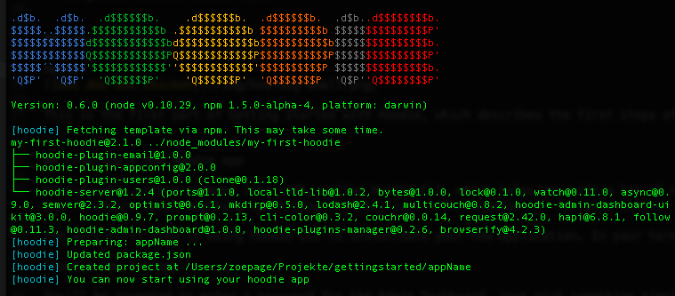
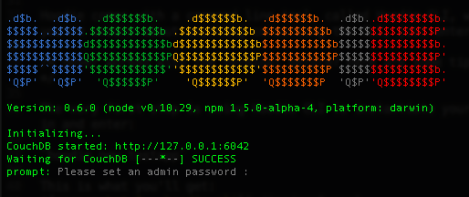
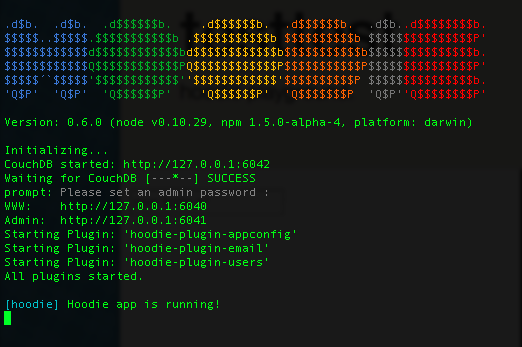

# Getting Started with Hoodie - Part One

## Prequisites
- installed Git
- installed CouchDB
- installed Nodejs
- installed Hoodie-CLI

Not done with the installation yet? <br />
This is how it works: ([Windows](#), [Mac](#), [Linux](#))


## Quick overview
 
- creating new app  /* (default or custom with -t) */
- app, admin and Futon URLs
- structure of a Hoodie Project
- including the script
- the global window.hoodie object


## Introduction

Hello!


This is the first part of Getting Started with Hoodie, which describes the first steps after you've successfully installed it. 


## Creating a new Hoodie app

Hoodie comes with a command line tool, called Hoodie-CLI, which helps you with a lot of Hoodie-related tasks, like setting up and running an app. If you're unsure about anything concerning the CLI, just enter `hoodie -h` for some hints.

/* never worked with the terminal before? here are some tipps and tricks! (http://blog.teamtreehouse.com/introduction-to-the-mac-os-x-command-line) */

The very first step is using Hoodie CLI to instantiate your new application. In your terminal, go to the directory you want your application to be in and enter:

`$ hoodie new testapp`

This is what you'll get:


If you'll experience any problems, please make sure to check the [FAQ](http://faq.hood.ie).

This will create a folder called `testapp`, in which you'll find a simple demo application. Let's open the directory and start up the Hoodie server!

```
$ cd testapp
$ hoodie start
```


You'll be prompted to enter a password for the Admin Dashboard, just pick something simple for now, like `123`.



That's it, your app should now start up and tell you a bunch of things about itself, for example at what URL you can access your app and which plugins it is running. The first thing you'll notice though is that Hoodie opens a browser with the demo app already running in it. 

As a side note, if you don't want Hoodie to open a browser, start the Hoodie server with `hoodie start -n`, for "no new browser tab please, I've already got one."

Let's scan through the CLI output really quickly:

    


There are three URLs in here:

1. __The CouchDB endpoint__: `CouchDB started: http://127.0.0.1:6098 ` 
It's what the Hoodie library talks to when it fetches and stores data. You can append `/_utils` to it to reach the CouchDB database admin tool (similar to phpMyAdmin for MySQL), which is called Futon. You can sign in to Futon with the admin password you set earlier. For now, you don't really have to bother with it.
2. __The application's URL__: `WWW:    http://127.0.0.1:6096`
This is the URL that Hoodie just opened in a browser for you, its where your app is running.
3. __The Admin Dashboard's URL__: `Admin:  http://127.0.0.1:6097`
We'll cover the dashboard in a later screencast, but it's where you can see how many users you have, reset their passwords, check out plugin backends etc. Again, the admin password you previously set will get you in.

But before we look at the demo app, let's stop the server with `ctrl-c` (on Macs) and take a quick look at the application folder.

# The Structure of a Hoodie Application

So what's in here?

```bash
$ ls
```


## The `README.md` file

Let's get the easiest part out of the way first – the readme file.
As the name suggests you should read it as it contains lots of useful information.

## The `package.json` file

Every Hoodie app is a node.js application and every node.js application needs a `package.json` file. It defines the name of the app (`testapp` in this case) and dependencies. It is used to install and declare the used versions of [`hoodie-server`](https://github.com/hoodiehq/hoodie-server) and all core plugins.

## The `node_modules` folder

`node_modules` is where npm, the package management system for Node, keeps all its files. Hoodie uses it to manage its plugins and dependencies, and you might use it too to manage front- and backend modules in your app. The content of this folder is determined by the previously mentioned `package.json` file in the app folder. To learn more about npm, check out [this introduction](#).

Normally one has to execute the `npm install` command to get this folder and its contents, but `hoodie new` did this for us already.

```bash
$ ls node_modules
hoodie-plugin-appconfig hoodie-plugin-email hoodie-plugin-users hoodie-server
```

The contents of the folder are essential for the Hoodie app to work, so there are two things to remember.

1. Do not edit the contents of this folder manually (only through npm)
2. Do not add this folder to source control

Here is a little experiment: Remove the `node_modules` folder entirely and run `npm install` afterwards. This should take a short while, but when it is finished you will notice that the install command restored all modules.

Now the above rules should be clear. All your changes to the files in this folder will be overwritten whenever you have to install or update dependencies and it makes no sense to put this huge folder into source control, because everyone can restore it with a simple command.

## The `data` folder

Yup, that's your database. It's not hidden away in `usr/local/` somewhere, it's right there in your app folder. This setup makes it really easy to move the app and its data to another system without much hassle. Also, if you want to clear all of your test data during development, you can just delete or rename this folder, Hoodie will recreate it and you can start with a clean slate. In fact, this folder wasn't generated by `hoodie new`, but by running the app once. You'll want to leave this out of source control, too.

## The `www` folder

`www` is where your app assets live. It includes the usual `index.html` and all of the app's assets. If you're into task runners such as Grunt or Gulp, this is where you'd put your compiled code (it's practically your `dist` folder). Hoodie doesn't care about what else you add to the app folder, so feel free to throw in your source folder, tests, more documentation, whatever you like.

# Templates

Now of course, you won't want to start with the demo application every single time, which is why `hoodie new` supports templates.

`hoodie new <appname> -t <template>`

[WIP: add some templates, where to get them, rolling your own etc.]

# Including Hoodie in your Application

The demo app will already have this line, but essentially, all you need to do to make your app Hoodie-ready is include a single `js` library:

    <script src="/_api/_files/hoodie.js"></script>

You'll notice that this file isn't in `node_modules` or some `vendor` or `lib` folder, instead, it is served directly by the Hoodie server itself. This is cool because it automatically contains all of the installed plugins' frontend code, too. Less hassle for you!

And that's actually it! You're ready to go.

# The global Hoodie object

Hoodie is designed to stay out of your way and let you build frontends the way you like to build frontends. The only way you talk to Hoodie in the frontend of your app is through the Hoodie API, and that lives in a global window object called, unsurprisingly, `window.hoodie`, or simply `hoodie`.

Go ahead, open the app in your browser, open your browser's dev tools and type `hoodie.`, it'll show you all of the globally available methods, like `hoodie.account` and `hoodie.store`, which are the most important ones. We'll cover these two in the next part of this series.

For now, congratulations! You've created a demo Hoodie app, learned about the basic structure of a Hoodie project, you know all about the endpoints and app URLs and how to include and use the Hoodie library in your project. I'd say your set for part two!


